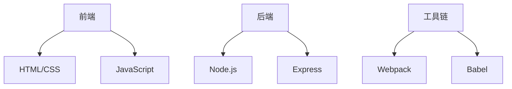

# 项目开发思维导图

## 核心功能
- 实时Markdown渲染
  - 支持CommonMark规范
  - 扩展功能：
    * 表格
    * 任务列表
    * 数学公式
- 文件树自动更新
  - WebSocket通知机制
  - 前端自动刷新

## 技术栈

## 开发计划
1. 第一阶段：基础功能
   - [x] Markdown解析
   - [x] 文件监听
   - [ ] 实时预览

2. 第二阶段：增强功能
   - 数学公式支持
   - 代码高亮
   - 导出PDF

## 测试用例
| 功能点       | 测试方法          | 预期结果       |
|-------------|------------------|---------------|
| 文件新增     | 添加.md文件       | 自动显示新文件 |
| 文件删除     | 删除.md文件       | 自动移除文件   |
| 内容修改     | 编辑已有文件      | 实时更新内容   |

## 数学公式示例
$$
f(x) = \int_{-\infty}^\infty \hat f(\xi)\,e^{2 \pi i \xi x} \,d\xi
$$
